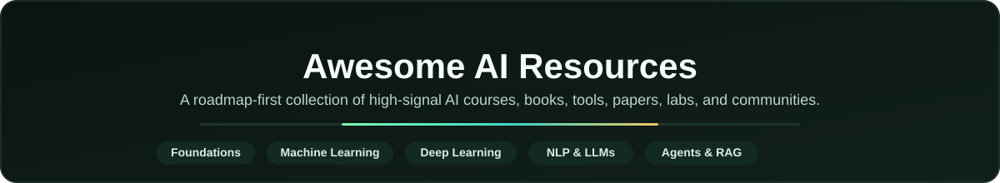
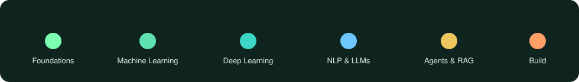

  

  
  
  
  
  

# Awesome AI Resources

A **roadmap-driven collection of free and legal AI resources**: courses, books, papers, tools, APIs, labs, and communities, ordered so you learn in the right sequence.

Built for:
- Beginners entering machine learning
- Engineers leveling up into LLMs and agents
- Builders shipping AI products
- Self-learners preparing for internships and jobs

> Goal: cut noise, keep depth, and point only to resources you can actually open.

---

## How to use this repository

1. Follow the path: **Foundations > ML > Deep Learning > NLP/LLMs > Agents and RAG > Build**
2. Pick one track at a time; you do **not** need every link
3. Prefer official / open content (no paywalled dumps, no shady mirrors)
4. Links are auto-checked **every Thursday**; broken ones are repaired or flagged

  

---

## Table of contents

- [Learning roadmap](#learning-roadmap)
  - [Foundations](#foundations-python-math--ml-basics)
  - [Machine learning](#machine-learning)
  - [Deep learning](#deep-learning)
  - [NLP and LLMs](#nlp-and-llms)
  - [Agents and RAG](#agents-and-rag)
  - [Specialize and build](#specialize-and-build)
- [Tools and APIs](#tools-and-apis)
  - [Chat and coding assistants](#chat-and-coding-assistants)
  - [Free / freemium LLM APIs](#free--freemium-llm-apis)
  - [Local AI](#local-ai)
  - [Frameworks and orchestration](#frameworks-and-orchestration)
  - [Embeddings and vector databases](#embeddings-and-vector-databases)
  - [Datasets and model hubs](#datasets-and-model-hubs)
- [Practice and communities](#practice-and-communities)
  - [Hands-on labs and platforms](#hands-on-labs-and-platforms)
  - [Newsletters and reading](#newsletters-and-reading)
  - [Communities and forums](#communities-and-forums)
- [Contributing](#contributing)

**Legend:** `[B]` Beginner · `[I]` Intermediate · `[A]` Advanced · `[P]` Editor pick

---

# Learning roadmap

## Foundations: Python, math & ML basics

### Python for AI
- [Python.org official tutorial](https://docs.python.org/3/tutorial/): Canonical language tour. `[B]`
- [Real Python](https://realpython.com/): Practical Python articles and guides. `[B]`
- [CS50 Introduction to Programming with Python](https://cs50.harvard.edu/python/): Free Harvard course with problem sets. `[B]` `[P]`

### Math for ML
- [Essence of Linear Algebra (3Blue1Brown)](https://www.youtube.com/playlist?list=PLZHQObOWTQDPD3MizzM2xVFitgF8hE_ab): Visual intuition for vectors and matrices. `[B]` `[P]`
- [Essence of Calculus (3Blue1Brown)](https://www.youtube.com/playlist?list=PLZHQObOWTQDMsr9K-rj53DwVRMYO3t5Yr): Derivatives and integrals the geometric way. `[B]`
- [Mathematics for Machine Learning (Imperial / Coursera free audit)](https://www.coursera.org/specializations/mathematics-machine-learning): Linear algebra, multivariate calculus, PCA. `[I]`
- [Immersive Linear Algebra](https://immersivemath.com/ila/index.html): Interactive free linear algebra book. `[B]`
- [StatQuest with Josh Starmer](https://www.youtube.com/@statquest): Clear stats/ML explainers. `[B]` `[P]`

### First ML overview
- [Google Machine Learning Crash Course](https://developers.google.com/machine-learning/crash-course): Free structured ML intro from Google. `[B]` `[P]`
- [fast.ai Practical Deep Learning for Coders](https://course.fast.ai/): Top-down deep learning for practitioners. `[B]` `[P]`
- [Elements of AI](https://www.elementsofai.com/): Non-technical AI literacy course. `[B]`

---

## Machine learning

### Courses
- [Andrew Ng Machine Learning Specialization](https://www.coursera.org/specializations/machine-learning-introduction): Classic supervised/unsupervised foundations (audit free). `[B]` `[P]`
- [MIT 6.036 Introduction to Machine Learning](https://openlearninglibrary.mit.edu/courses/course-v1:MITx+6.036+1T2019/about): Rigorous undergrad ML. `[I]`
- [scikit-learn User Guide](https://scikit-learn.org/stable/user_guide.html): Definitive classical ML library docs. `[B]`
- [Kaggle Learn](https://www.kaggle.com/learn): Short free micro-courses with notebooks. `[B]`

### Free books and notes
- [An Introduction to Statistical Learning (ISLP)](https://www.statlearning.com/): Free PDF + labs; gold-standard intro. `[B]` `[P]`
- [Hands-On Machine Learning resources (Geron companion)](https://github.com/ageron/handson-ml3): Official notebooks for the popular book. `[I]`
- [Pattern Recognition and Machine Learning (Bishop) errata and resources](https://www.microsoft.com/en-us/research/publication/pattern-recognition-machine-learning/): Classic probabilistic ML reference. `[A]`
- [Probabilistic Machine Learning (Murphy) book site](https://probml.github.io/pml-book/): Modern free draft / companion materials. `[A]`

### Practice
- [Kaggle Competitions](https://www.kaggle.com/competitions): Real datasets and public notebooks. `[I]`
- [OpenML](https://www.openml.org/): Open datasets and reproducible ML experiments. `[I]`

---

## Deep learning

### Courses
- [Neural Networks: Zero to Hero (Andrej Karpathy)](https://karpathy.ai/zero-to-hero.html): Build neural nets and GPT pieces from scratch. `[I]` `[P]`
- [DeepLearning.AI Deep Learning Specialization](https://www.coursera.org/specializations/deep-learning): CNNs, RNNs, sequence models (audit free). `[I]`
- [Stanford CS231n](http://cs231n.stanford.edu/): Computer vision classic course. `[A]`
- [MIT 6.S191 Introduction to Deep Learning](http://introtodeeplearning.com/): Short, intense DL intro with labs. `[I]` `[P]`
- [NYU Deep Learning (Yann LeCun)](https://atcold.github.io/NYU-DLSP21/): Free course materials and notebooks. `[A]`

### Frameworks and docs
- [PyTorch Tutorials](https://pytorch.org/tutorials/): Official beginner to advanced tutorials. `[B]` `[P]`
- [TensorFlow Tutorials](https://www.tensorflow.org/tutorials): Official Keras/TF learning path. `[B]`
- [JAX Documentation](https://docs.jax.dev/en/latest/): Composable NumPy + autodiff. `[A]`

### Free books
- [Deep Learning Book (Goodfellow, Bengio, Courville)](https://www.deeplearningbook.org/): Free online deep learning textbook. `[A]` `[P]`
- [Dive into Deep Learning](https://d2l.ai/): Interactive free book with code (PyTorch/MXNet/JAX). `[I]` `[P]`
- [Neural Networks and Deep Learning (Nielsen)](http://neuralnetworksanddeeplearning.com/): Friendly free online book. `[B]`

---

## NLP and LLMs

### Courses
- [Hugging Face NLP Course](https://huggingface.co/learn/nlp-course): Transformers, tokenizers, fine-tuning. `[I]` `[P]`
- [Stanford CS224n NLP with Deep Learning](https://web.stanford.edu/class/cs224n/): Foundational NLP course. `[A]`
- [DeepLearning.AI Generative AI courses](https://www.deeplearning.ai/courses/): Short free GenAI / LLM courses. `[B]` `[P]`
- [LangChain Academy](https://academy.langchain.com/): Free courses on LangChain and LangGraph. `[I]`

### Prompting and LLM engineering
- [OpenAI Prompt Engineering Guide](https://platform.openai.com/docs/guides/prompt-engineering): Official prompting patterns. `[B]`
- [Anthropic Prompt Engineering Overview](https://docs.anthropic.com/en/docs/build-with-claude/prompt-engineering/overview): Claude-focused prompting. `[B]`
- [Prompt Engineering Guide](https://www.promptingguide.ai/): Community-maintained prompting encyclopedia. `[B]` `[P]`
- [OpenAI Cookbook](https://cookbook.openai.com/): Practical LLM recipes and notebooks. `[I]`

### Papers and reading lists
- [Attention Is All You Need](https://arxiv.org/abs/1706.03762): The Transformer paper. `[A]` `[P]`
- [BERT](https://arxiv.org/abs/1810.04805): Bidirectional pretraining breakthrough. `[A]`
- [GPT-3 / Language Models are Few-Shot Learners](https://arxiv.org/abs/2005.14165): Scaling and in-context learning. `[A]`
- [Illustrated Transformer (Jay Alammar)](https://jalammar.github.io/illustrated-transformer/): Best visual explainer. `[B]` `[P]`
- [Papers With Code NLP](https://paperswithcode.com/area/natural-language-processing): Papers, leaderboards, and code. `[I]`

---

## Agents and RAG

### Courses and guides
- [Hugging Face Agents Course](https://huggingface.co/learn/agents-course): Build agents end-to-end, free. `[I]` `[P]`
- [Anthropic Courses](https://github.com/anthropics/courses): Prompting, tool use, RAG, agents. `[I]` `[P]`
- [LangChain RAG Tutorials](https://python.langchain.com/docs/tutorials/rag/): Official RAG walkthrough. `[I]`
- [LlamaIndex Documentation](https://docs.llamaindex.ai/en/stable/): Data framework for LLM apps. `[I]`
- [OpenAI Assistants / Responses docs](https://platform.openai.com/docs/overview): Official OpenAI API building blocks. `[I]`

### Agent frameworks
- [LangGraph](https://langchain-ai.github.io/langgraph/): Stateful multi-actor agent graphs. `[I]`
- [Microsoft AutoGen](https://microsoft.github.io/autogen/): Multi-agent conversation framework. `[I]`
- [CrewAI](https://docs.crewai.com/): Role-based multi-agent crews. `[I]`
- [Semantic Kernel](https://learn.microsoft.com/en-us/semantic-kernel/): Microsoft orchestration SDK. `[I]`

### Evaluation and safety
- [OWASP Top 10 for LLM Applications](https://owasp.org/www-project-top-10-for-large-language-model-applications/): Security risks for LLM apps. `[I]` `[P]`
- [Anthropic Building Effective Agents](https://www.anthropic.com/engineering/building-effective-agents): Practical agent design notes. `[I]` `[P]`
- [RAGAS](https://docs.ragas.io/): RAG evaluation framework. `[I]`

---

## Specialize and build

### Computer vision
- [Hugging Face Computer Vision Course](https://huggingface.co/learn/computer-vision-course): Free CV with transformers/diffusers. `[I]`
- [PyTorch Vision Docs](https://pytorch.org/vision/stable/index.html): Models, datasets, transforms. `[I]`

### Speech and multimodal
- [OpenAI Whisper](https://github.com/openai/whisper): Robust speech recognition. `[I]`
- [Hugging Face Audio Course](https://huggingface.co/learn/audio-course): ASR, TTS, audio transformers. `[I]`
- [Stable Diffusion web resources (Stability)](https://stability.ai/): Image generation ecosystem hub. `[I]`

### MLOps and production
- [Made With ML](https://madewithml.com/): Production ML course (free). `[I]` `[P]`
- [Full Stack Deep Learning](https://fullstackdeeplearning.com/): Course on shipping ML systems. `[I]`
- [Weights and Biases Docs](https://docs.wandb.ai/): Experiment tracking. `[B]`
- [MLflow Documentation](https://mlflow.org/docs/latest/index.html): Open-source ML lifecycle. `[I]`

### Careers and interviews
- [Hugging Face Jobs](https://huggingface.co/jobs): ML/AI job board. `[B]`
- [Machine Learning Interview (khangich)](https://github.com/khangich/machine-learning-interview): Curated ML system design and interview notes. `[I]`
- [Chip Huyen ML interviews and systems](https://huyenchip.com/): Essays on ML systems and careers. `[I]` `[P]`

---

# Tools and APIs

## Chat and coding assistants
| Tool | Link | Notes |
|------|------|-------|
| ChatGPT | https://chatgpt.com/ | Free tier + paid |
| Google Gemini | https://gemini.google.com/ | Strong free multimodal |
| Claude | https://claude.ai/ | Free tier available |
| Microsoft Copilot | https://copilot.microsoft.com/ | Free assistant in Edge/Windows |
| Perplexity | https://www.perplexity.ai/ | Search-grounded answers |
| Cursor | https://cursor.com/ | AI-first code editor |
| GitHub Copilot | https://github.com/features/copilot | Free for eligible students / OSS |
| Continue | https://www.continue.dev/ | Open-source coding assistant |

## Free / freemium LLM APIs
- [GroqCloud](https://console.groq.com/): Very fast OpenAI-compatible inference. `[B]` `[P]`
- [Google AI Studio (Gemini API)](https://aistudio.google.com/): Free Gemini API key tier. `[B]` `[P]`
- [OpenRouter](https://openrouter.ai/): Multi-model router with free models. `[B]`
- [Together AI](https://www.together.ai/): Open-model inference (free credits). `[I]`
- [Fireworks AI](https://fireworks.ai/): Fast inference for open models. `[I]`
- [Hugging Face Inference Providers](https://huggingface.co/docs/inference-providers): Run models via HF. `[I]`
- [Cloudflare Workers AI](https://developers.cloudflare.com/workers-ai/): Edge AI inference free tier. `[I]`

## Local AI
- [Ollama](https://ollama.com/): Run LLMs locally with a simple CLI. `[B]` `[P]`
- [LM Studio](https://lmstudio.ai/): Desktop UI for local models. `[B]`
- [GPT4All](https://www.nomic.ai/gpt4all): Local chat on consumer hardware. `[B]`
- [llama.cpp](https://github.com/ggerganov/llama.cpp): Efficient C/C++ LLM inference. `[I]` `[P]`
- [Open WebUI](https://github.com/open-webui/open-webui): ChatGPT-like UI for Ollama / OpenAI APIs. `[B]`
- [Jan](https://jan.ai/): Offline-first desktop AI. `[B]`
- [vLLM](https://github.com/vllm-project/vllm): High-throughput serving engine. `[A]`
- [Hugging Face Transformers](https://huggingface.co/docs/transformers): The Python model library. `[I]` `[P]`

## Frameworks and orchestration
- [LangChain](https://python.langchain.com/): Popular LLM application framework. `[I]`
- [LlamaIndex](https://www.llamaindex.ai/): RAG / data agents. `[I]`
- [Haystack](https://haystack.deepset.ai/): Production NLP/RAG pipelines. `[I]`
- [DSPy](https://dspy.ai/): Programmatic prompting and optimization. `[A]`
- [Instructor](https://python.useinstructor.com/): Structured LLM outputs. `[I]`
- [PydanticAI](https://ai.pydantic.dev/): Type-safe agent framework. `[I]`
- [LiteLLM](https://docs.litellm.ai/): Unified API across 100+ providers. `[I]`

## Embeddings and vector databases
- [Chroma](https://www.trychroma.com/): Developer-friendly vector DB. `[B]`
- [Qdrant](https://qdrant.tech/): Vector search engine (open-source + cloud). `[I]`
- [Weaviate](https://weaviate.io/): Open-source vector database. `[I]`
- [pgvector](https://github.com/pgvector/pgvector): Vector extension for Postgres. `[I]` `[P]`
- [FAISS](https://github.com/facebookresearch/faiss): Similarity search library from Meta. `[A]`
- [Pinecone](https://www.pinecone.io/): Managed vector DB (free tier). `[B]`
- [sentence-transformers](https://www.sbert.net/): Easy embedding models. `[B]` `[P]`

## Datasets and model hubs
- [Hugging Face Hub](https://huggingface.co/): Models, datasets, Spaces. `[B]` `[P]`
- [Hugging Face Datasets](https://huggingface.co/docs/datasets): Dataset loading library. `[B]`
- [TensorFlow Datasets](https://www.tensorflow.org/datasets): Ready-to-use TF datasets. `[B]`
- [Papers With Code](https://paperswithcode.com/): SOTA papers with implementations. `[I]` `[P]`
- [EleutherAI](https://www.eleuther.ai/): Open research org (GPT-NeoX, evals). `[A]`
- [LAION](https://laion.ai/): Large open image-text datasets. `[A]`
- [Common Crawl](https://commoncrawl.org/): Open web crawl corpus. `[A]`

---

# Practice and communities

## Hands-on labs and platforms
- [Google Colab](https://colab.research.google.com/): Free GPU notebooks in the browser. `[B]` `[P]`
- [Kaggle Notebooks](https://www.kaggle.com/code): Free notebooks + GPUs + datasets. `[B]`
- [Hugging Face Spaces](https://huggingface.co/spaces): Host demos for free. `[B]`
- [Weights and Biases Reports / gallery](https://wandb.ai/fully-connected): Public ML write-ups. `[I]`
- [LeetCode](https://leetcode.com/): Algorithms practice (useful for ML interviews). `[B]`
- [NeetCode](https://neetcode.io/): Curated coding interview paths. `[B]`
- [Lightning AI Studios](https://lightning.ai/): Cloud studios for PyTorch Lightning. `[I]`
- [Modal](https://modal.com/): Serverless GPUs for experiments (free credits). `[I]`

## Newsletters and reading
- [The Batch (DeepLearning.AI)](https://www.deeplearning.ai/the-batch/): Weekly AI news from Andrew Ng's team. `[B]` `[P]`
- [Import AI (Jack Clark)](https://importai.substack.com/): Research and policy oriented AI newsletter. `[I]`
- [TLDR AI](https://tldr.tech/ai): Short daily AI digest. `[B]`
- [AlphaSignal](https://alphasignal.ai/): ML research and tooling highlights. `[I]`
- [SemiAnalysis](https://www.semianalysis.com/): AI infra / semiconductor analysis (mixed free). `[A]`
- [Distill](https://distill.pub/): Visual ML explainers (classic archive). `[I]` `[P]`
- [Lil'Log (Lilian Weng)](https://lilianweng.github.io/): Deep dives on RL, agents, LLMs. `[A]` `[P]`
- [Simon Willison's Weblog](https://simonwillison.net/): Practical LLM engineering notes. `[I]` `[P]`

## Communities and forums
- [r/MachineLearning](https://www.reddit.com/r/MachineLearning/): Large research/discussion subreddit. `[I]`
- [r/LocalLLaMA](https://www.reddit.com/r/LocalLLaMA/): Local models, quantization, tooling. `[I]` `[P]`
- [Hugging Face Discord](https://discord.com/invite/hugging-face): Official HF community. `[B]`
- [EleutherAI Discord](https://discord.gg/eleutherai): Open ML research community. `[A]`
- [PyTorch Forums](https://discuss.pytorch.org/): Official PyTorch Q&A. `[B]`
- [Latent Space community](https://www.latent.space/): AI eng podcast and community hub. `[I]`
- [AI Engineer](https://www.aicamp.so/): Events and community for AI builders. `[I]`
- [LangChain Discord](https://discord.gg/langchain): LangChain community. `[I]`

---

## Contributing

Contributions welcome. Keep the bar high:

1. Resource must be **free or meaningfully freemium** and **legal** to access
2. Prefer official docs, open textbooks, reputable courses, and maintained repos
3. Add a one-line description + difficulty marker (`[B]` / `[I]` / `[A]`, optional `[P]`)
4. Place it in the correct roadmap / tools / practice section
5. Open a PR; weekly link health will re-verify URLs every Thursday

Do **not** submit paywalled ebook dumps, cracked PDFs, or dead mirrors.

---

### Found this useful?

Star the repo and share it with someone learning AI.

Maintained by [mohabdelkarim](https://github.com/mohabdelkarim).
